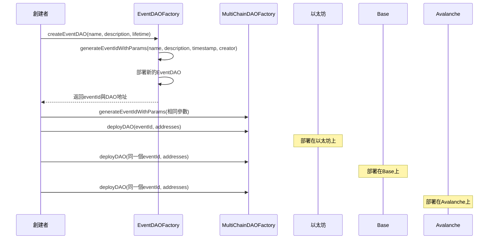
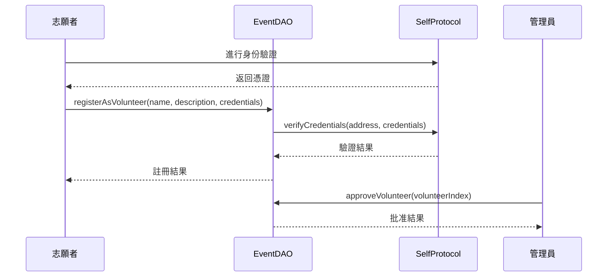
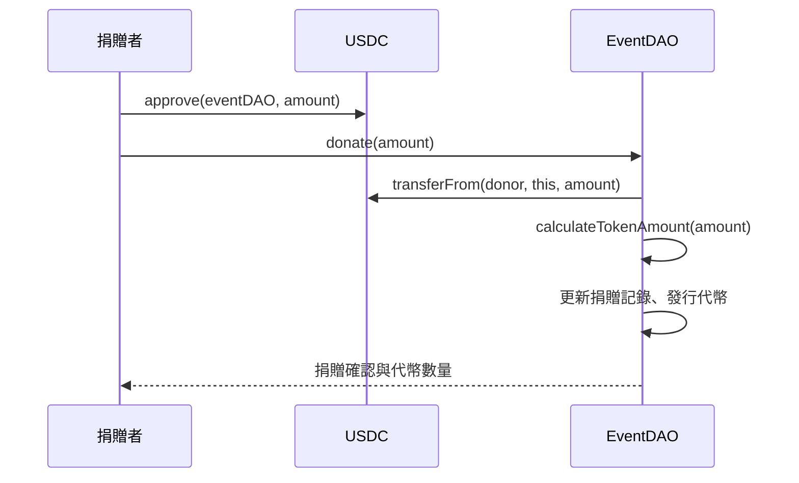
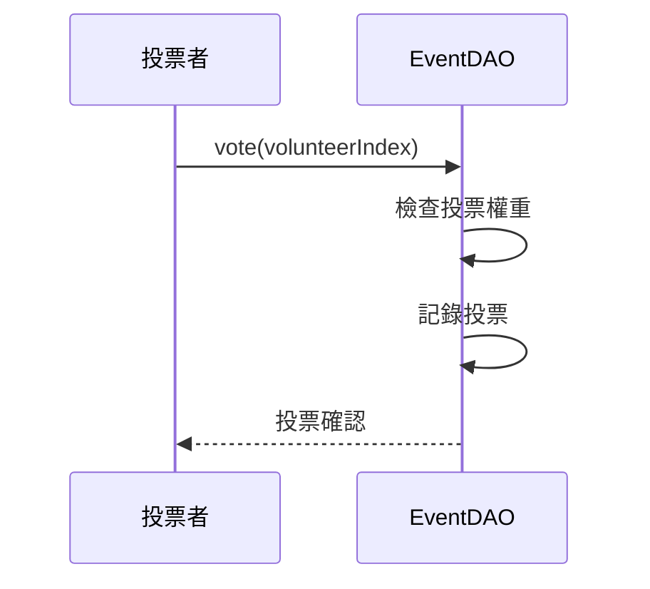
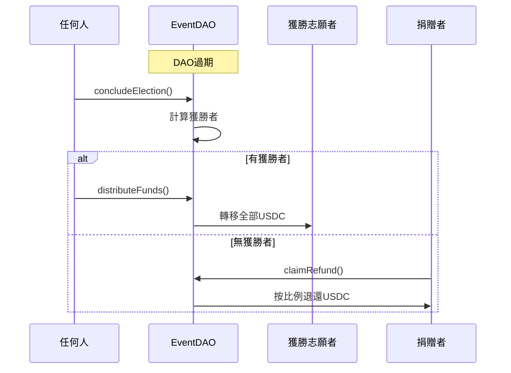
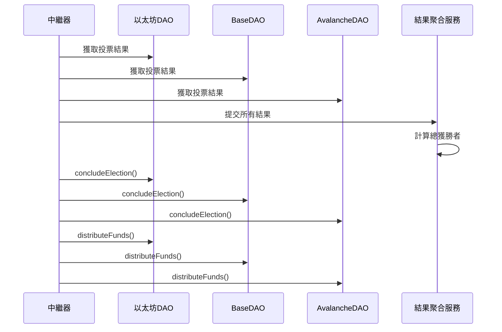

# FlashDAO 多鏈事件式捐贈與治理系統

本文檔詳細說明了FlashDAO系統的功能、流程及各角色的互動方式。FlashDAO是一個多鏈捐贈與治理系統，允許用戶創建、參與和管理特定事件的DAOs。

## 目錄

- [系統架構](#系統架構)
- [合約結構](#合約結構)
- [系統流程](#系統流程)
- [用戶視角](#用戶視角)
  - [系統管理員](#系統管理員)
  - [事件創建者](#事件創建者)
  - [捐贈者](#捐贈者)
  - [志願者](#志願者)
  - [投票者](#投票者)
- [函數接口詳解](#函數接口詳解)
- [跨鏈互操作](#跨鏈互操作)
- [安全考量](#安全考量)

## 系統架構

FlashDAO系統由四個主要組件構成：

1. **EventDAOFactory**: 創建與管理單鏈EventDAO實例
2. **MultiChainDAOFactory**: 提供跨鏈部署與協調功能
3. **EventDAO**: 單一事件的DAO，管理捐贈、投票和資金分配
4. **VolunteerRegistry**: 管理志願者註冊和身份驗證

此外，系統還集成了：
- **FlashDAOToken**: 治理代幣，用於投票權重計算
- **Self Protocol**: 用於身份驗證

## 合約結構

```
FlashDAO
├── EventDAOFactory.sol - 事件DAO工廠
├── MultiChainDAOFactory.sol - 多鏈DAO工廠
├── EventDAO.sol - 事件DAO主合約
├── VolunteerRegistry.sol - 志願者註冊合約
├── FlashDAOToken.sol - 治理代幣
├── interfaces/
│   └── ISelfProtocol.sol - Self協議接口
└── mocks/
    ├── SelfProtocolMock.sol - 測試用協議模擬
    └── ERC20Mock.sol - 測試用ERC20代幣
```

## 系統流程

以下是系統的整體流程，從事件創建到資金分配：

### 1. 事件創建與多鏈部署



### 2. 志願者註冊與批准



### 3. 捐贈與代幣發行



### 4. 投票過程



### 5. 選舉結束與資金分配



### 6. 跨鏈結果聚合 (外部流程)



## 用戶視角

### 系統管理員

系統管理員負責部署和管理整體系統。

**相關合約**: `EventDAOFactory`, `MultiChainDAOFactory`

| 階段 | 操作 | 函數調用 |
|------|------|---------|
| 初始部署 | 部署EventDAOFactory | `constructor(usdcAddress, selfProtocolAddress)` |
| 初始部署 | 部署MultiChainDAOFactory | `constructor()` |
| 權限管理 | 添加事件創建者角色 | `grantRole(CREATOR_ROLE, address)` |
| 權限管理 | 添加部署者角色 | `grantRole(DEPLOYER_ROLE, address)` |
| 緊急操作 | 停用特定鏈上的DAO | `deactivateDAO(eventId)` |

### 事件創建者

事件創建者創建並管理特定事件的DAOs。

**相關合約**: `EventDAOFactory`, `MultiChainDAOFactory`, `EventDAO`

| 階段 | 操作 | 函數調用 |
|------|------|---------|
| 事件創建 | 生成事件ID | `generateEventIdWithParams(name, description, timestamp, creator)` |
| 事件創建 | 創建事件DAO | `createEventDAO(name, description, lifetime)` |
| 多鏈部署 | 在其他鏈部署相同DAO | `deployDAO(eventId, daoAddress, tokenAddress, registryAddress)` |
| 志願者管理 | 批准志願者 | `approveVolunteer(volunteerIndex)` |
| 選舉管理 | 結束選舉 | `concludeElection()` |
| 資金分配 | 分配資金給獲勝者 | `distributeFunds()` |
| 數據查詢 | 查看活躍事件 | `getActiveEventDAOs()` |
| 數據查詢 | 查看過期事件 | `getExpiredEventDAOs()` |
| 跨鏈管理 | 查看多鏈部署情況 | `getDeployment(eventId, chainId)` |
| 跨鏈管理 | 查詢活躍多鏈部署 | `getActiveDeploymentsOnCurrentChain()` |

### 捐贈者

捐贈者向事件提供資金並獲得投票權。

**相關合約**: `EventDAO`

| 階段 | 操作 | 函數調用 |
|------|------|---------|
| 準備捐贈 | 批准USDC支出 | USDC: `approve(eventDAOAddress, amount)` |
| 捐贈 | 捐贈USDC | `donate(amount)` |
| 投票 | 為志願者投票 | `vote(volunteerIndex)` |
| 退款 | 如無獲勝者，申請退款 | `claimRefund()` |
| 數據查詢 | 查看自己的投票權 | `votingPower(address)` |
| 數據查詢 | 查看自己的捐贈金額 | `donations(address)` |
| 數據查詢 | 查看自己的代幣餘額 | `balanceOf(address)` |

### 志願者

志願者註冊參與特定事件並提供服務。

**相關合約**: `EventDAO`, `SelfProtocol`

| 階段 | 操作 | 函數調用 |
|------|------|---------|
| 身份驗證 | 使用Self Protocol驗證身份 | Self Protocol: 相關身份驗證流程 |
| 註冊 | 註冊為志願者 | `registerAsVolunteer(name, description, credentials)` |
| 等待批准 | 等待管理員批准 | N/A |
| 接收資金 | 如獲勝，接收資金 | 自動接收USDC |
| 數據查詢 | 查詢自己的志願者信息 | `getVolunteer(volunteerIndex)` |
| 數據查詢 | 查詢自己獲得的票數 | `volunteerVotes(volunteerIndex)` |

### 投票者

投票者使用代幣投票選擇志願者。

**相關合約**: `EventDAO`

| 階段 | 操作 | 函數調用 |
|------|------|---------|
| 獲取投票權 | 捐贈USDC獲取代幣 | `donate(amount)` |
| 查看志願者 | 查看志願者信息 | `getVolunteer(volunteerIndex)` |
| 投票 | 為志願者投票 | `vote(volunteerIndex)` |
| 數據查詢 | 查看投票權重 | `votingPower(address)` |
| 數據查詢 | 檢查是否已投票 | `hasVoted(address)` |

## 函數接口詳解

### EventDAOFactory

```solidity
// 創建事件DAO
function createEventDAO(
    string calldata eventName,
    string calldata eventDescription,
    uint256 lifetime
) external onlyRole(CREATOR_ROLE) returns (bytes32)

// 生成事件ID
function generateEventIdWithParams(
    string memory eventName,
    string memory eventDescription,
    uint256 creationTimestamp,
    address creator
) public pure returns (bytes32)

// 獲取活躍的事件DAOs
function getActiveEventDAOs() external view returns (bytes32[] memory)

// 獲取過期的事件DAOs
function getExpiredEventDAOs() external view returns (bytes32[] memory)

// 獲取事件DAO總數
function getEventDAOCount() external view returns (uint256)
```

### MultiChainDAOFactory

```solidity
// 在當前鏈部署DAO
function deployDAO(
    bytes32 eventId,
    address eventDAOAddress,
    address tokenAddress,
    address volunteerRegistryAddress
) external onlyRole(DEPLOYER_ROLE)

// 生成事件ID (與EventDAOFactory使用相同邏輯)
function generateEventIdWithParams(
    string memory eventName,
    string memory eventDescription,
    uint256 creationTimestamp,
    address creator
) public pure returns (bytes32)

// 兼容性方法
function generateEventId(
    string memory eventName,
    string memory eventDescription
) external view returns (bytes32)

// 停用DAO
function deactivateDAO(bytes32 eventId) external onlyRole(ADMIN_ROLE)

// 獲取特定鏈上的部署信息
function getDeployment(bytes32 eventId, uint256 chainId) external view returns (ChainDeployment memory)

// 獲取當前鏈上的部署信息
function getCurrentChainDeployment(bytes32 eventId) external view returns (ChainDeployment memory)

// 獲取所有事件IDs
function getAllEventIds() external view returns (bytes32[] memory)

// 獲取事件總數
function getEventCount() external view returns (uint256)

// 獲取當前鏈上所有活躍部署
function getActiveDeploymentsOnCurrentChain() external view returns (bytes32[] memory)
```

### EventDAO

```solidity
// 捐贈USDC
function donate(uint256 amount) external nonReentrant

// 註冊為志願者
function registerAsVolunteer(
    string calldata name,
    string calldata description,
    bytes calldata credentials
) external nonReentrant

// 批准志願者
function approveVolunteer(uint256 _volunteerIndex) external onlyRole(ADMIN_ROLE)

// 投票給志願者
function vote(uint256 _volunteerIndex) external nonReentrant

// 結束選舉
function concludeElection() external nonReentrant

// 分配資金給獲勝者
function distributeFunds() external nonReentrant

// 無獲勝者時申請退款
function claimRefund() external nonReentrant

// 計算代幣數量
function calculateTokenAmount(uint256 donationAmount) public pure returns (uint256)

// 獲取總捐贈金額
function getTotalDonations() public view returns (uint256)

// 獲取所有捐贈者
function getDonors() public view returns (address[] memory)

// 獲取捐贈者數量
function getDonorCount() external view returns (uint256)

// 獲取志願者數量
function getVolunteerCount() external view returns (uint256)

// 獲取志願者信息
function getVolunteer(uint256 index) external view returns (address, string memory, string memory, bool, uint256)

// 檢查DAO是否過期
function isExpired() external view returns (bool)

// 檢查是否處於退款模式
function isInRefundMode() external view returns (bool)
```

### VolunteerRegistry

```solidity
// 註冊志願者
function registerVolunteer(address volunteer, string memory name, string memory description) external

// 批准志願者
function approveVolunteer(address volunteer) external onlyRole(ADMIN_ROLE)

// 移除志願者
function removeVolunteer(address volunteer) external onlyRole(ADMIN_ROLE)

// 檢查地址是否為志願者
function isVolunteer(address volunteer) external view returns (bool)

// 獲取志願者信息
function getVolunteerInfo(address volunteer) external view returns (VolunteerInfo memory)

// 獲取所有志願者
function getAllVolunteers() external view returns (address[] memory)

// 獲取志願者數量
function getVolunteerCount() external view returns (uint256)
```

## 跨鏈互操作

FlashDAO 支持在多個區塊鏈上部署相同的事件 DAO，並通過生成一致的事件 ID 實現跨鏈協調。

### 跨鏈事件 ID 生成

生成一致的事件 ID 對於跨鏈操作至關重要：

```solidity
function generateEventIdWithParams(
    string memory eventName,
    string memory eventDescription,
    uint256 creationTimestamp,
    address creator
) public pure returns (bytes32) {
    return keccak256(abi.encodePacked(eventName, eventDescription, creationTimestamp, creator));
}
```

這確保了相同的參數在任何鏈上都會生成相同的 ID。

### 跨鏈協調流程

1. 在第一條鏈上創建事件 DAO，記錄事件參數與 ID
2. 在其他鏈上使用相同參數部署 DAO，確保事件 ID 一致
3. 捐贈者和投票者可以在任何鏈上參與
4. 外部中繼系統收集各個鏈上的投票結果
5. 中繼器調用各鏈上的 `concludeElection()` 和 `distributeFunds()`
6. 各鏈上的資金分別分配給獲勝志願者

## 安全考量

### 參數驗證

所有關鍵函數都執行輸入驗證：

```solidity
// 事件創建時
require(bytes(eventName).length > 0, "Event name cannot be empty");

// 捐贈時
require(amount > 0, "Amount must be greater than 0");

// 投票時
require(_volunteerIndex < volunteers.length, "Invalid volunteer index");
require(volunteers[_volunteerIndex].approved, "Volunteer not approved");
require(votingPower[msg.sender] > 0, "No voting power");
require(!hasVoted[msg.sender], "Already voted");
```

### 重入攻擊保護

敏感函數使用 ReentrancyGuard：

```solidity
function donate(uint256 amount) external nonReentrant { ... }
function vote(uint256 _volunteerIndex) external nonReentrant { ... }
function concludeElection() external nonReentrant { ... }
function distributeFunds() external nonReentrant { ... }
function claimRefund() external nonReentrant { ... }
```

### 權限控制

使用 AccessControl 管理角色權限：

```solidity
function approveVolunteer(uint256 _volunteerIndex) external onlyRole(ADMIN_ROLE) { ... }
function createEventDAO(...) external onlyRole(CREATOR_ROLE) returns (bytes32) { ... }
function deployDAO(...) external onlyRole(DEPLOYER_ROLE) { ... }
function deactivateDAO(bytes32 eventId) external onlyRole(ADMIN_ROLE) { ... }
```

### 資金安全

USDC 轉移使用 CEI (檢查-效果-互動) 模式：

```solidity
// 在 distributeFunds()
require(electionConcluded, "Election not concluded");
require(!fundsDistributed, "Funds already distributed");
require(!noWinner, "No winner elected");

fundsDistributed = true; // 先設置狀態

// 然後執行轉帳
uint256 balance = usdcToken.balanceOf(address(this));
require(usdcToken.transfer(winner, balance), "USDC transfer failed");
```

## 測試方法

FlashDAO系統可以通過多種方法進行測試，從本地開發環境到實際上鏈部署。以下是可用的測試方法：

### 1. 本地單元測試

**測試工具**: Hardhat + Mocha + Chai

```bash
# 運行所有測試
npx hardhat test

# 運行特定測試文件
npx hardhat test test/EventDAO.test.js
npx hardhat test test/FlashDAOToken.test.ts
npx hardhat test test/MultiChainDAO.test.js
```

單元測試覆蓋了以下功能：
- 事件DAO創建與配置
- 志願者註冊和審批流程
- 捐贈機制與代幣發行
- 投票流程
- 選舉結果計算
- 資金分配與退款機制
- 跨鏈事件ID生成一致性

### 2. 模擬網絡測試

使用Hardhat內置網絡進行集成測試：

```bash
# 啟動本地Hardhat節點
npx hardhat node

# 在本地節點部署合約
npx hardhat run scripts/deploy.js --network localhost
```

模擬網絡測試可以：
- 測試合約之間的交互
- 驗證完整的用戶流程
- 測試Gas優化
- 模擬多賬戶交互

### 3. 分叉測試

從主網或測試網分叉狀態進行測試：

```bash
# 從特定網絡分叉
npx hardhat node --fork https://eth-mainnet.g.alchemy.com/v2/YOUR_API_KEY

# 在分叉環境部署合約
npx hardhat run scripts/deploy.js --network localhost
```

分叉測試優勢：
- 使用真實網絡狀態
- 測試與真實協議的交互（如USDC）
- 無需真實代幣即可進行測試

### 4. 多鏈模擬測試

模擬跨鏈部署和互操作：

```javascript
// 模擬多鏈環境的腳本示例
async function simulateMultiChainDeployment() {
  // 模擬以太坊鏈
  const chainId1 = 1;
  await network.provider.request({
    method: "hardhat_setChaindId",
    params: [ethers.utils.hexValue(chainId1)]
  });
  
  // 部署在"以太坊"
  const { eventId } = await deployOnEthereum();
  
  // 模擬Base鏈
  const chainId2 = 84532;
  await network.provider.request({
    method: "hardhat_setChaindId",
    params: [ethers.utils.hexValue(chainId2)]
  });
  
  // 在"Base"上部署相同事件
  await deployOnBase(eventId);
  
  // 執行跨鏈操作測試...
}
```

### 5. 測試網部署測試

在公共測試網上部署並測試：

```bash
# 部署到Sepolia測試網
npx hardhat deploy --network sepolia

# 部署到Base Sepolia測試網
npx hardhat deploy --network baseSepolia

# 部署到Avalanche Fuji測試網
npx hardhat deploy --network fuji
```

測試網測試優勢：
- 測試真實區塊鏈環境
- 驗證跨鏈部署
- 測試不同網絡的Gas成本
- 獲取公開可驗證的部署地址

### 6. 鏈上交互測試腳本

使用腳本模擬用戶互動：

```javascript
// 模擬完整的用戶流程
async function simulateUserFlow() {
  // 初始化合約交互
  const eventDAO = await ethers.getContractAt("EventDAO", deployedAddress);
  const usdc = await ethers.getContractAt("IERC20", usdcAddress);
  
  // 1. 捐贈者交互
  await usdc.approve(eventDAO.address, donationAmount);
  await eventDAO.donate(donationAmount);
  
  // 2. 志願者註冊
  await eventDAO.registerAsVolunteer("志願團體A", "提供救災服務", credentials);
  
  // 3. 管理員批准
  await eventDAO.approveVolunteer(0);
  
  // 4. 投票過程
  await eventDAO.vote(0);
  
  // 5. 時間快進
  await ethers.provider.send("evm_increaseTime", [lifetime + 1]);
  await ethers.provider.send("evm_mine");
  
  // 6. 結束選舉和資金分配
  await eventDAO.concludeElection();
  await eventDAO.distributeFunds();
}
```

### 7. 審計與代碼覆蓋率

```bash
# 運行代碼覆蓋率分析
npx hardhat coverage

# 運行Slither靜態分析
slither .
```

### 8. 實際上鏈測試

實際上鏈是最終的測試階段，包含以下步驟：

1. **主網部署**:
   ```bash
   npx hardhat deploy --network mainnet
   npx hardhat deploy --network base
   npx hardhat deploy --network avalanche
   ```

2. **多階段部署策略**:
   - 首先部署基礎合約（如工廠合約）
   - 驗證合約功能後再部署其他組件
   - 使用多簽錢包進行關鍵操作

3. **真實用戶測試**:
   - 先與有限的真實用戶進行內部測試
   - 逐步擴大用戶群體
   - 收集反饋並調整

4. **跨鏈協調測試**:
   - 實際測試跨鏈事件ID生成
   - 驗證多鏈結果聚合機制

5. **鏈上事件監控**:
   - 設置監控系統追蹤關鍵事件
   - 實時監控合約狀態和交互

### 9. 自動化測試與CI/CD

設置自動化測試流程：

```yaml
# .github/workflows/test.yml 示例
name: Smart Contract Tests

on:
  push:
    branches: [ main, develop ]
  pull_request:
    branches: [ main, develop ]

jobs:
  test:
    runs-on: ubuntu-latest
    steps:
      - uses: actions/checkout@v2
      - name: Use Node.js
        uses: actions/setup-node@v2
        with:
          node-version: '16'
      - name: Install dependencies
        run: npm ci
      - name: Run tests
        run: npx hardhat test
      - name: Run coverage
        run: npx hardhat coverage
```

### 10. 混沌測試

模擬極端情況：

- 測試極高的捐贈量
- 測試大量志願者註冊
- 模擬網絡阻塞和高Gas費
- 測試合約交互時序邊界情況

### 結論

FlashDAO系統的完整測試應採用多層次方法，從單元測試開始，逐步擴展到測試網，最終進行實際上鏈部署。由於系統的跨鏈性質，特別要注意測試：

1. 跨鏈事件ID的一致性生成
2. 多鏈部署的協調機制
3. 各鏈上獨立資金分配流程

實際上鏈前，應確保系統通過全面審計，並制定詳細的部署和緊急響應計劃。 

## 測試網部署指南

為了確保系統在主網上線前的穩定性和安全性，強烈建議先在測試網上進行全面測試。本指南將詳細說明如何在Base Sepolia和Ethereum Sepolia上部署和測試FlashDAO系統。

### 預備工作

1. **測試網帳戶設置**:
   ```bash
   # 創建新的測試網專用錢包
   npx hardhat accounts:create test-deployer
   
   # 將私鑰安全存儲在.env文件中
   echo "PRIVATE_KEY_SEPOLIA=your_private_key_here" >> .env
   echo "PRIVATE_KEY_BASE_SEPOLIA=your_private_key_here" >> .env
   ```

2. **獲取測試網代幣**:
   - Ethereum Sepolia: 訪問 [Sepolia水龍頭](https://sepoliafaucet.com/)
   - Base Sepolia: 訪問 [Base水龍頭](https://www.base.org/developers/docs/tools/sepolia-faucet)

3. **配置網絡連接**:
   編輯 `hardhat.config.js`:

   ```javascript
   module.exports = {
     networks: {
       hardhat: {
         // ...
       },
       sepolia: {
         url: `https://eth-sepolia.g.alchemy.com/v2/${process.env.ALCHEMY_API_KEY}`,
         accounts: [process.env.PRIVATE_KEY_SEPOLIA]
       },
       baseSepolia: {
         url: `https://sepolia.base.org`,
         accounts: [process.env.PRIVATE_KEY_BASE_SEPOLIA],
         gasPrice: 1000000000,
         chainId: 84532
       }
     },
     // ...
   };
   ```

4. **獲取測試網USDC合約**:
   - 對於Sepolia: 部署一個ERC20Mock作為測試USDC
   - 對於Base Sepolia: 使用Bridge USDC或部署測試代幣

### Base Sepolia部署步驟

1. **部署基礎合約**:

   ```bash
   # 部署Self Protocol模擬合約
   npx hardhat run scripts/deploy-self-protocol-mock.js --network baseSepolia
   
   # 如果沒有測試USDC，部署ERC20Mock
   npx hardhat run scripts/deploy-usdc-mock.js --network baseSepolia
   ```

2. **部署工廠合約**:

   ```bash
   # 部署EventDAOFactory (使用上面部署的合約地址)
   npx hardhat run scripts/deploy-factory.js --network baseSepolia
   
   # 部署MultiChainDAOFactory
   npx hardhat run scripts/deploy-multichain-factory.js --network baseSepolia
   ```

3. **授予角色權限**:

   ```javascript
   // scripts/setup-roles.js
   async function main() {
     const factory = await ethers.getContractAt("EventDAOFactory", "FACTORY_ADDRESS");
     const multiChainFactory = await ethers.getContractAt("MultiChainDAOFactory", "MULTICHAIN_FACTORY_ADDRESS");
     
     // 授予CREATOR_ROLE
     await factory.grantRole(await factory.CREATOR_ROLE(), "YOUR_CREATOR_ADDRESS");
     
     // 授予DEPLOYER_ROLE
     await multiChainFactory.grantRole(await multiChainFactory.DEPLOYER_ROLE(), "YOUR_DEPLOYER_ADDRESS");
     
     console.log("Roles granted successfully");
   }
   
   main()
     .then(() => process.exit(0))
     .catch((error) => {
       console.error(error);
       process.exit(1);
     });
   ```

   執行:
   ```bash
   npx hardhat run scripts/setup-roles.js --network baseSepolia
   ```

4. **驗證合約**:

   ```bash
   # 驗證EventDAOFactory
   npx hardhat verify --network baseSepolia FACTORY_ADDRESS "USDC_ADDRESS" "SELF_PROTOCOL_ADDRESS"
   
   # 驗證MultiChainDAOFactory
   npx hardhat verify --network baseSepolia MULTICHAIN_FACTORY_ADDRESS
   ```

### Ethereum Sepolia部署步驟

1. **執行相同的步驟在Sepolia上**:

   ```bash
   # 部署Self Protocol模擬合約
   npx hardhat run scripts/deploy-self-protocol-mock.js --network sepolia
   
   # 部署USDC模擬合約
   npx hardhat run scripts/deploy-usdc-mock.js --network sepolia
   
   # 部署工廠合約
   npx hardhat run scripts/deploy-factory.js --network sepolia
   npx hardhat run scripts/deploy-multichain-factory.js --network sepolia
   
   # 設置角色
   npx hardhat run scripts/setup-roles.js --network sepolia
   ```

2. **驗證合約**:

   ```bash
   npx hardhat verify --network sepolia FACTORY_ADDRESS "USDC_ADDRESS" "SELF_PROTOCOL_ADDRESS"
   npx hardhat verify --network sepolia MULTICHAIN_FACTORY_ADDRESS
   ```

### 跨鏈測試

一旦在兩個測試網上完成部署，可以開始進行跨鏈測試:

1. **創建跨鏈事件**:

   ```javascript
   // scripts/create-cross-chain-event.js
   async function main() {
     // 連接到第一條鏈(Sepolia)
     let provider = new ethers.providers.JsonRpcProvider(process.env.SEPOLIA_RPC_URL);
     let wallet = new ethers.Wallet(process.env.PRIVATE_KEY_SEPOLIA, provider);
     
     // 連接到工廠合約
     const factory = new ethers.Contract(
       "SEPOLIA_FACTORY_ADDRESS",
       factoryAbi,
       wallet
     );
     
     // 創建事件參數
     const eventName = "Test Disaster Relief";
     const eventDescription = "Testing cross-chain coordination for disaster relief";
     const lifetime = 60 * 60 * 24 * 7; // 7 天
     
     // 在Sepolia上創建EventDAO
     console.log("Creating EventDAO on Sepolia...");
     const tx = await factory.createEventDAO(eventName, eventDescription, lifetime);
     const receipt = await tx.wait();
     
     // 從事件中獲取eventID
     const eventId = // 從日誌中提取eventID
     console.log(`Event created on Sepolia with ID: ${eventId}`);
     
     // 保存eventId、設置和時間戳以便在第二個鏈上使用
     fs.writeFileSync('eventDetails.json', JSON.stringify({
       eventId,
       eventName,
       eventDescription,
       creationTimestamp: Math.floor(Date.now() / 1000),
       creator: wallet.address
     }));
     
     console.log("Event details saved to eventDetails.json");
   }
   
   main()
     .then(() => process.exit(0))
     .catch((error) => {
       console.error(error);
       process.exit(1);
     });
   ```

2. **在Base Sepolia上部署相同事件**:

   ```javascript
   // scripts/deploy-on-base.js
   async function main() {
     // 讀取之前保存的事件詳情
     const eventDetails = JSON.parse(fs.readFileSync('eventDetails.json'));
     
     // 連接到Base Sepolia
     let provider = new ethers.providers.JsonRpcProvider(process.env.BASE_SEPOLIA_RPC_URL);
     let wallet = new ethers.Wallet(process.env.PRIVATE_KEY_BASE_SEPOLIA, provider);
     
     // 連接到工廠合約
     const multiChainFactory = new ethers.Contract(
       "BASE_SEPOLIA_MULTICHAIN_FACTORY_ADDRESS",
       multiChainFactoryAbi,
       wallet
     );
     
     // 檢查生成的eventId是否一致
     const generatedEventId = await multiChainFactory.generateEventIdWithParams(
       eventDetails.eventName,
       eventDetails.eventDescription,
       eventDetails.creationTimestamp,
       eventDetails.creator
     );
     
     console.log(`Generated eventId on Base: ${generatedEventId}`);
     console.log(`Original eventId from Sepolia: ${eventDetails.eventId}`);
     
     if(generatedEventId !== eventDetails.eventId) {
       console.error("EVENT IDs DO NOT MATCH!");
       return;
     }
     
     console.log("Event IDs match, deploying on Base Sepolia...");
     
     // 在Base Sepolia上創建相同事件的DAO
     // 首先創建DAO
     const baseFactory = new ethers.Contract(
       "BASE_SEPOLIA_FACTORY_ADDRESS",
       factoryAbi,
       wallet
     );
     
     const tx1 = await baseFactory.createEventDAO(
       eventDetails.eventName,
       eventDetails.eventDescription,
       60 * 60 * 24 * 7 // 7 天
     );
     await tx1.wait();
     
     // 然後在多鏈工廠註冊
     const tx2 = await multiChainFactory.deployDAO(
       eventDetails.eventId,
       "BASE_DAO_ADDRESS",
       "BASE_TOKEN_ADDRESS",
       "BASE_REGISTRY_ADDRESS"
     );
     await tx2.wait();
     
     console.log("Successfully deployed on Base Sepolia with same event ID");
   }
   
   main()
     .then(() => process.exit(0))
     .catch((error) => {
       console.error(error);
       process.exit(1);
     });
   ```

### 測試網互動腳本

創建腳本模擬用戶互動:

```javascript
// scripts/test-user-interaction.js
async function main() {
  // 在Sepolia上捐贈
  await donateOnSepolia();
  
  // 在Base Sepolia上註冊志願者
  await registerVolunteerOnBase();
  
  // 在Sepolia上投票
  await voteOnSepolia();
  
  // 在Base Sepolia上投票
  await voteOnBase();
  
  // 獲取跨鏈投票結果
  await getCrossChainResults();
}

async function donateOnSepolia() {
  // 初始化合約連接
  const eventDAO = await getEventDAOContract("sepolia");
  const usdc = await getUSDCContract("sepolia");
  
  // 核准和捐贈
  const amount = ethers.utils.parseUnits("100", 6); // 假設USDC有6位小數
  await usdc.approve(eventDAO.address, amount);
  await eventDAO.donate(amount);
  
  console.log("Donated 100 USDC on Sepolia");
}

async function registerVolunteerOnBase() {
  const eventDAO = await getEventDAOContract("baseSepolia");
  
  // 註冊志願者
  await eventDAO.registerAsVolunteer(
    "Base Relief Team",
    "Providing emergency supplies",
    "0x..." // 憑證
  );
  
  console.log("Registered as volunteer on Base Sepolia");
  
  // 批准志願者 (需要ADMIN權限)
  await eventDAO.approveVolunteer(0);
}

async function voteOnSepolia() {
  const eventDAO = await getEventDAOContract("sepolia");
  
  // 投票給志願者
  await eventDAO.vote(0);
  console.log("Voted on Sepolia");
}

// 合約幫助函數
async function getEventDAOContract(network) {
  const addresses = {
    sepolia: "SEPOLIA_DAO_ADDRESS",
    baseSepolia: "BASE_SEPOLIA_DAO_ADDRESS"
  };
  
  const provider = getProvider(network);
  const wallet = getWallet(network, provider);
  
  return new ethers.Contract(
    addresses[network],
    eventDAOAbi,
    wallet
  );
}

// 其他幫助函數...

main()
  .then(() => process.exit(0))
  .catch((error) => {
    console.error(error);
    process.exit(1);
  });
```

### 測試數據收集與監控

1. **使用區塊瀏覽器監控**:
   - Sepolia: [https://sepolia.etherscan.io/](https://sepolia.etherscan.io/)
   - Base Sepolia: [https://sepolia-explorer.base.org/](https://sepolia-explorer.base.org/)

2. **創建監控儀表板**:
   使用TheGraph或Dune Analytics創建測試儀表板來跟踪:
   - 跨鏈捐贈
   - 志願者註冊
   - 投票分布
   - 資金分配

3. **測試結果報告模板**:

   ```markdown
   # FlashDAO 測試網測試報告
   
   ## 測試環境
   - 以太坊 Sepolia: [合約地址]
   - Base Sepolia: [合約地址]
   
   ## 測試案例結果
   
   ### 1. 事件創建
   - ✅ 事件ID在兩條鏈上一致
   - ✅ 事件詳情正確顯示
   
   ### 2. 志願者註冊
   - ✅ 在Base上註冊志願者成功
   - ✅ 管理員批准流程正常
   
   ### 3. 捐贈
   - ✅ Sepolia上捐贈USDC成功
   - ✅ 代幣鑄造計算正確
   
   ### 4. 投票
   - ✅ 跨鏈投票正常
   - ✅ 票數準確記錄
   
   ### 5. 跨鏈協調
   - ✅ 結果聚合正確
   - ✅ 資金分配執行成功
   
   ## 問題與解決方案
   1. [問題描述]
      - [解決方案]
   
   ## Gas消耗統計
   | 操作 | Sepolia (gas) | Base Sepolia (gas) |
   |------|--------------|------------------|
   | 創建DAO | x | y |
   | 捐贈 | x | y |
   | 投票 | x | y |
   
   ## 最終結論
   [總結測試發現和建議]
   ```

### 從測試網到主網的遷移計劃

1. **審查測試結果**:
   - 檢查所有跨鏈事件ID一致性
   - 分析Gas使用情況
   - 確認志願者註冊、投票和資金分配流程正常

2. **修復和改進**:
   - 解決測試中發現的任何問題
   - 優化高Gas消耗操作
   - 增強安全性措施

3. **主網部署計劃**:
   - 準備多簽錢包
   - 制定分階段部署策略
   - 建立監控和應急響應系統

4. **主網啟動清單**:
   ```
   □ 完成測試網測試
   □ 完成合約審計
   □ 準備主網部署腳本
   □ 設置多簽錢包
   □ 準備啟動公告
   □ 設置監控系統
   □ 準備緊急響應團隊
   ```

通過測試網的全面測試，您可以確保FlashDAO系統在主網上線前達到穩定和安全的標準，並為用戶提供無縫的跨鏈體驗。 