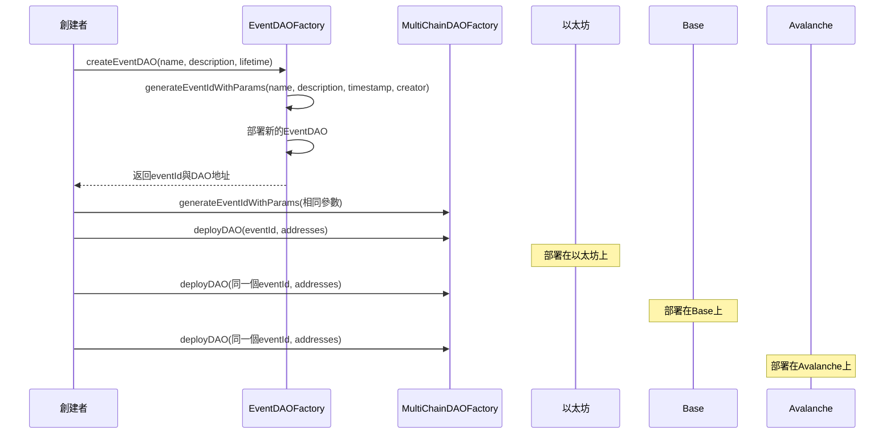
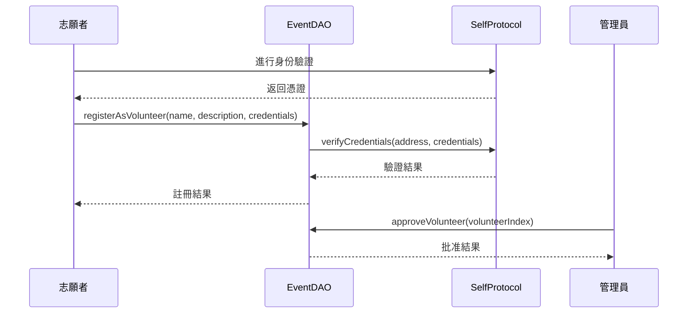
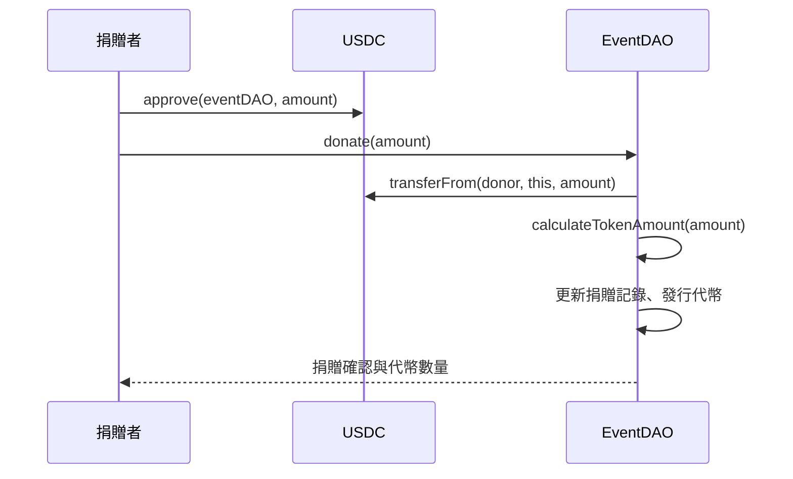
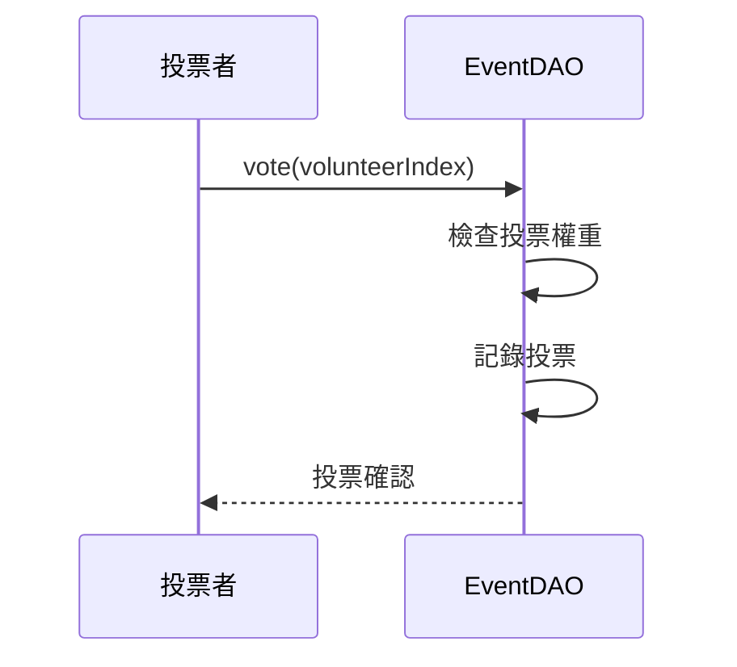
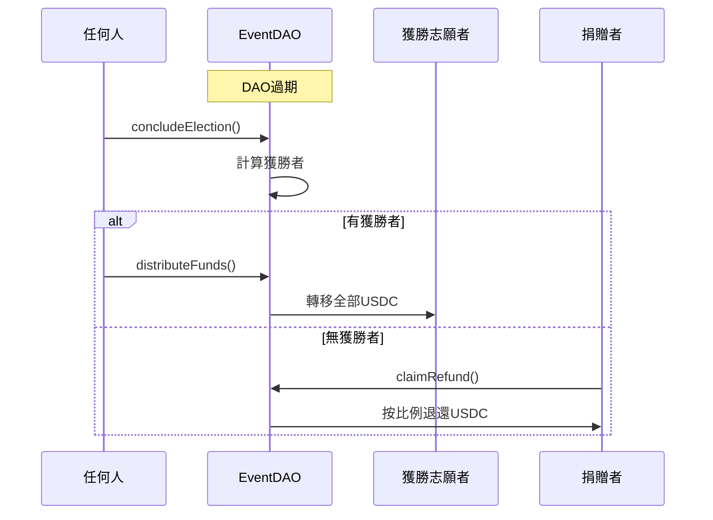
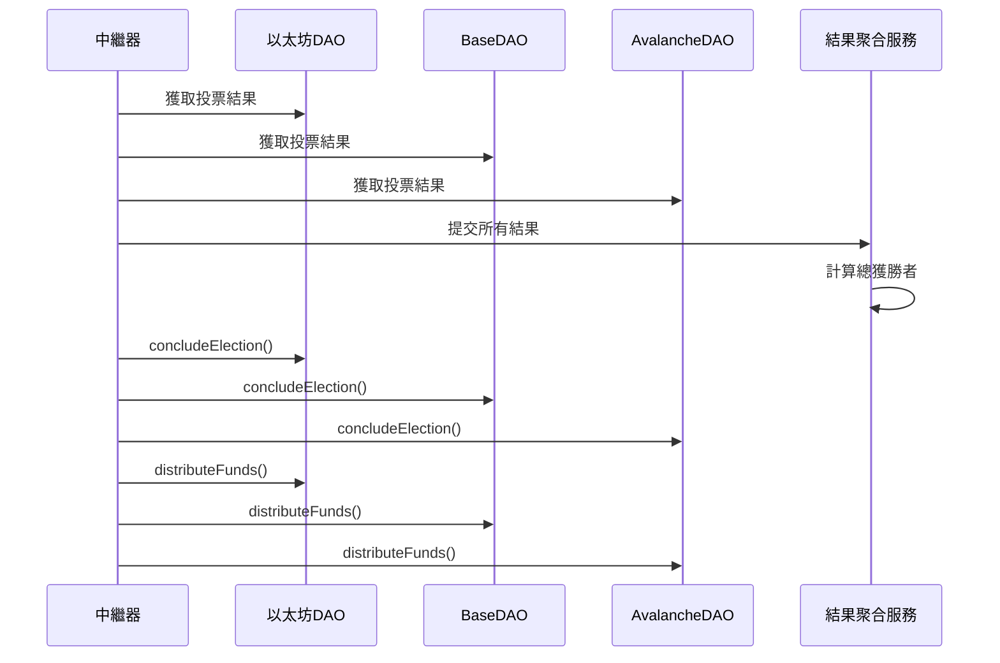

# FlashDAO 多鏈事件式捐贈與治理系統

本文檔詳細說明了FlashDAO系統的功能、流程及各角色的互動方式。FlashDAO是一個多鏈捐贈與治理系統，允許用戶創建、參與和管理特定事件的DAOs。

## 目錄

- [系統架構](#系統架構)
- [合約結構](#合約結構)
- [系統流程](#系統流程)
- [用戶視角](#用戶視角)
  - [系統管理員](#系統管理員)
  - [事件創建者](#事件創建者)
  - [捐贈者](#捐贈者)
  - [志願者](#志願者)
  - [投票者](#投票者)
- [函數接口詳解](#函數接口詳解)
- [跨鏈互操作](#跨鏈互操作)
- [安全考量](#安全考量)

## 系統架構

FlashDAO系統由四個主要組件構成：

1. **EventDAOFactory**: 創建與管理單鏈EventDAO實例
2. **MultiChainDAOFactory**: 提供跨鏈部署與協調功能
3. **EventDAO**: 單一事件的DAO，管理捐贈、投票和資金分配
4. **VolunteerRegistry**: 管理志願者註冊和身份驗證

此外，系統還集成了：
- **FlashDAOToken**: 治理代幣，用於投票權重計算
- **Self Protocol**: 用於身份驗證

## 合約結構

```
FlashDAO
├── EventDAOFactory.sol - 事件DAO工廠
├── MultiChainDAOFactory.sol - 多鏈DAO工廠
├── EventDAO.sol - 事件DAO主合約
├── VolunteerRegistry.sol - 志願者註冊合約
├── FlashDAOToken.sol - 治理代幣
├── interfaces/
│   └── ISelfProtocol.sol - Self協議接口
└── mocks/
    ├── SelfProtocolMock.sol - 測試用協議模擬
    └── ERC20Mock.sol - 測試用ERC20代幣
```

## 系統流程

以下是系統的整體流程，從事件創建到資金分配：

### 1. 事件創建與多鏈部署



### 2. 志願者註冊與批准



### 3. 捐贈與代幣發行



### 4. 投票過程



### 5. 選舉結束與資金分配



### 6. 跨鏈結果聚合 (外部流程)



## 用戶視角

### 系統管理員

系統管理員負責部署和管理整體系統。

**相關合約**: `EventDAOFactory`, `MultiChainDAOFactory`

| 階段 | 操作 | 函數調用 |
|------|------|---------|
| 初始部署 | 部署EventDAOFactory | `constructor(usdcAddress, selfProtocolAddress)` |
| 初始部署 | 部署MultiChainDAOFactory | `constructor()` |
| 權限管理 | 添加事件創建者角色 | `grantRole(CREATOR_ROLE, address)` |
| 權限管理 | 添加部署者角色 | `grantRole(DEPLOYER_ROLE, address)` |
| 緊急操作 | 停用特定鏈上的DAO | `deactivateDAO(eventId)` |

### 事件創建者

事件創建者創建並管理特定事件的DAOs。

**相關合約**: `EventDAOFactory`, `MultiChainDAOFactory`, `EventDAO`

| 階段 | 操作 | 函數調用 |
|------|------|---------|
| 事件創建 | 生成事件ID | `generateEventIdWithParams(name, description, timestamp, creator)` |
| 事件創建 | 創建事件DAO | `createEventDAO(name, description, lifetime)` |
| 多鏈部署 | 在其他鏈部署相同DAO | `deployDAO(eventId, daoAddress, tokenAddress, registryAddress)` |
| 志願者管理 | 批准志願者 | `approveVolunteer(volunteerIndex)` |
| 選舉管理 | 結束選舉 | `concludeElection()` |
| 資金分配 | 分配資金給獲勝者 | `distributeFunds()` |
| 數據查詢 | 查看活躍事件 | `getActiveEventDAOs()` |
| 數據查詢 | 查看過期事件 | `getExpiredEventDAOs()` |
| 跨鏈管理 | 查看多鏈部署情況 | `getDeployment(eventId, chainId)` |
| 跨鏈管理 | 查詢活躍多鏈部署 | `getActiveDeploymentsOnCurrentChain()` |

### 捐贈者

捐贈者向事件提供資金並獲得投票權。

**相關合約**: `EventDAO`

| 階段 | 操作 | 函數調用 |
|------|------|---------|
| 準備捐贈 | 批准USDC支出 | USDC: `approve(eventDAOAddress, amount)` |
| 捐贈 | 捐贈USDC | `donate(amount)` |
| 投票 | 為志願者投票 | `vote(volunteerIndex)` |
| 退款 | 如無獲勝者，申請退款 | `claimRefund()` |
| 數據查詢 | 查看自己的投票權 | `votingPower(address)` |
| 數據查詢 | 查看自己的捐贈金額 | `donations(address)` |
| 數據查詢 | 查看自己的代幣餘額 | `balanceOf(address)` |

### 志願者

志願者註冊參與特定事件並提供服務。

**相關合約**: `EventDAO`, `SelfProtocol`

| 階段 | 操作 | 函數調用 |
|------|------|---------|
| 身份驗證 | 使用Self Protocol驗證身份 | Self Protocol: 相關身份驗證流程 |
| 註冊 | 註冊為志願者 | `registerAsVolunteer(name, description, credentials)` |
| 等待批准 | 等待管理員批准 | N/A |
| 接收資金 | 如獲勝，接收資金 | 自動接收USDC |
| 數據查詢 | 查詢自己的志願者信息 | `getVolunteer(volunteerIndex)` |
| 數據查詢 | 查詢自己獲得的票數 | `volunteerVotes(volunteerIndex)` |

### 投票者

投票者使用代幣投票選擇志願者。

**相關合約**: `EventDAO`

| 階段 | 操作 | 函數調用 |
|------|------|---------|
| 獲取投票權 | 捐贈USDC獲取代幣 | `donate(amount)` |
| 查看志願者 | 查看志願者信息 | `getVolunteer(volunteerIndex)` |
| 投票 | 為志願者投票 | `vote(volunteerIndex)` |
| 數據查詢 | 查看投票權重 | `votingPower(address)` |
| 數據查詢 | 檢查是否已投票 | `hasVoted(address)` |

## 函數接口詳解

### EventDAOFactory

```solidity
// 創建事件DAO
function createEventDAO(
    string calldata eventName,
    string calldata eventDescription,
    uint256 lifetime
) external onlyRole(CREATOR_ROLE) returns (bytes32)

// 生成事件ID
function generateEventIdWithParams(
    string memory eventName,
    string memory eventDescription,
    uint256 creationTimestamp,
    address creator
) public pure returns (bytes32)

// 獲取活躍的事件DAOs
function getActiveEventDAOs() external view returns (bytes32[] memory)

// 獲取過期的事件DAOs
function getExpiredEventDAOs() external view returns (bytes32[] memory)

// 獲取事件DAO總數
function getEventDAOCount() external view returns (uint256)
```

### MultiChainDAOFactory

```solidity
// 在當前鏈部署DAO
function deployDAO(
    bytes32 eventId,
    address eventDAOAddress,
    address tokenAddress,
    address volunteerRegistryAddress
) external onlyRole(DEPLOYER_ROLE)

// 生成事件ID (與EventDAOFactory使用相同邏輯)
function generateEventIdWithParams(
    string memory eventName,
    string memory eventDescription,
    uint256 creationTimestamp,
    address creator
) public pure returns (bytes32)

// 兼容性方法
function generateEventId(
    string memory eventName,
    string memory eventDescription
) external view returns (bytes32)

// 停用DAO
function deactivateDAO(bytes32 eventId) external onlyRole(ADMIN_ROLE)

// 獲取特定鏈上的部署信息
function getDeployment(bytes32 eventId, uint256 chainId) external view returns (ChainDeployment memory)

// 獲取當前鏈上的部署信息
function getCurrentChainDeployment(bytes32 eventId) external view returns (ChainDeployment memory)

// 獲取所有事件IDs
function getAllEventIds() external view returns (bytes32[] memory)

// 獲取事件總數
function getEventCount() external view returns (uint256)

// 獲取當前鏈上所有活躍部署
function getActiveDeploymentsOnCurrentChain() external view returns (bytes32[] memory)
```

### EventDAO

```solidity
// 捐贈USDC
function donate(uint256 amount) external nonReentrant

// 註冊為志願者
function registerAsVolunteer(
    string calldata name,
    string calldata description,
    bytes calldata credentials
) external nonReentrant

// 批准志願者
function approveVolunteer(uint256 _volunteerIndex) external onlyRole(ADMIN_ROLE)

// 投票給志願者
function vote(uint256 _volunteerIndex) external nonReentrant

// 結束選舉
function concludeElection() external nonReentrant

// 分配資金給獲勝者
function distributeFunds() external nonReentrant

// 無獲勝者時申請退款
function claimRefund() external nonReentrant

// 計算代幣數量
function calculateTokenAmount(uint256 donationAmount) public pure returns (uint256)

// 獲取總捐贈金額
function getTotalDonations() public view returns (uint256)

// 獲取所有捐贈者
function getDonors() public view returns (address[] memory)

// 獲取捐贈者數量
function getDonorCount() external view returns (uint256)

// 獲取志願者數量
function getVolunteerCount() external view returns (uint256)

// 獲取志願者信息
function getVolunteer(uint256 index) external view returns (address, string memory, string memory, bool, uint256)

// 檢查DAO是否過期
function isExpired() external view returns (bool)

// 檢查是否處於退款模式
function isInRefundMode() external view returns (bool)
```

### VolunteerRegistry

```solidity
// 註冊志願者
function registerVolunteer(address volunteer, string memory name, string memory description) external

// 批准志願者
function approveVolunteer(address volunteer) external onlyRole(ADMIN_ROLE)

// 移除志願者
function removeVolunteer(address volunteer) external onlyRole(ADMIN_ROLE)

// 檢查地址是否為志願者
function isVolunteer(address volunteer) external view returns (bool)

// 獲取志願者信息
function getVolunteerInfo(address volunteer) external view returns (VolunteerInfo memory)

// 獲取所有志願者
function getAllVolunteers() external view returns (address[] memory)

// 獲取志願者數量
function getVolunteerCount() external view returns (uint256)
```

## 跨鏈互操作

FlashDAO 支持在多個區塊鏈上部署相同的事件 DAO，並通過生成一致的事件 ID 實現跨鏈協調。

### 跨鏈事件 ID 生成

生成一致的事件 ID 對於跨鏈操作至關重要：

```solidity
function generateEventIdWithParams(
    string memory eventName,
    string memory eventDescription,
    uint256 creationTimestamp,
    address creator
) public pure returns (bytes32) {
    return keccak256(abi.encodePacked(eventName, eventDescription, creationTimestamp, creator));
}
```

這確保了相同的參數在任何鏈上都會生成相同的 ID。

### 跨鏈協調流程

1. 在第一條鏈上創建事件 DAO，記錄事件參數與 ID
2. 在其他鏈上使用相同參數部署 DAO，確保事件 ID 一致
3. 捐贈者和投票者可以在任何鏈上參與
4. 外部中繼系統收集各個鏈上的投票結果
5. 中繼器調用各鏈上的 `concludeElection()` 和 `distributeFunds()`
6. 各鏈上的資金分別分配給獲勝志願者

## 安全考量

### 參數驗證

所有關鍵函數都執行輸入驗證：

```solidity
// 事件創建時
require(bytes(eventName).length > 0, "Event name cannot be empty");

// 捐贈時
require(amount > 0, "Amount must be greater than 0");

// 投票時
require(_volunteerIndex < volunteers.length, "Invalid volunteer index");
require(volunteers[_volunteerIndex].approved, "Volunteer not approved");
require(votingPower[msg.sender] > 0, "No voting power");
require(!hasVoted[msg.sender], "Already voted");
```

### 重入攻擊保護

敏感函數使用 ReentrancyGuard：

```solidity
function donate(uint256 amount) external nonReentrant { ... }
function vote(uint256 _volunteerIndex) external nonReentrant { ... }
function concludeElection() external nonReentrant { ... }
function distributeFunds() external nonReentrant { ... }
function claimRefund() external nonReentrant { ... }
```

### 權限控制

使用 AccessControl 管理角色權限：

```solidity
function approveVolunteer(uint256 _volunteerIndex) external onlyRole(ADMIN_ROLE) { ... }
function createEventDAO(...) external onlyRole(CREATOR_ROLE) returns (bytes32) { ... }
function deployDAO(...) external onlyRole(DEPLOYER_ROLE) { ... }
function deactivateDAO(bytes32 eventId) external onlyRole(ADMIN_ROLE) { ... }
```

### 資金安全

USDC 轉移使用 CEI (檢查-效果-互動) 模式：

```solidity
// 在 distributeFunds()
require(electionConcluded, "Election not concluded");
require(!fundsDistributed, "Funds already distributed");
require(!noWinner, "No winner elected");

fundsDistributed = true; // 先設置狀態

// 然後執行轉帳
uint256 balance = usdcToken.balanceOf(address(this));
require(usdcToken.transfer(winner, balance), "USDC transfer failed");
``` 