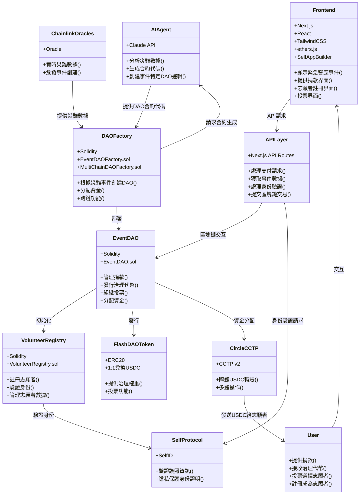

```mermaid
classDiagram
    title FlashDAO系統組件圖
    
    %% 前端層
    class Frontend {
        +Next.js
        +React
        +TailwindCSS
        +ethers.js
        +SelfAppBuilder
        +顯示緊急響應事件()
        +提供捐款界面()
        +志願者註冊界面()
        +投票界面()
    }
    
    %% API/後端層
    class APILayer {
        +Next.js API Routes
        +處理支付請求()
        +獲取事件數據()
        +處理身份驗證()
        +提交區塊鏈交易()
    }
    
    %% AI層
    class AIAgent {
        +Claude API
        +分析災難數據()
        +生成合約代碼()
        +創建事件特定DAO邏輯()
    }
    
    %% 區塊鏈層 - DAO工廠
    class DAOFactory {
        +Solidity
        +EventDAOFactory.sol
        +MultiChainDAOFactory.sol
        +根據災難事件創建DAO()
        +分配資金()
        +跨鏈功能()
    }
    
    %% 區塊鏈層 - 事件DAO
    class EventDAO {
        +Solidity
        +EventDAO.sol
        +管理捐款()
        +發行治理代幣()
        +組織投票()
        +分配資金()
    }
    
    %% 區塊鏈層 - 志願者註冊
    class VolunteerRegistry {
        +Solidity
        +VolunteerRegistry.sol
        +註冊志願者()
        +驗證身份()
        +管理志願者數據()
    }
    
    %% 代幣
    class FlashDAOToken {
        +ERC20
        +1:1兌換USDC
        +提供治理權重()
        +投票功能()
    }
    
    %% 外部整合 - 身份驗證
    class SelfProtocol {
        +SelfID
        +驗證護照資訊()
        +隱私保護身份證明()
    }
    
    %% 外部整合 - 跨鏈支付
    class CircleCCTP {
        +CCTP v2
        +跨鏈USDC轉賬()
        +多鏈操作()
    }
    
    %% 外部整合 - 事件數據
    class ChainlinkOracles {
        +Oracle
        +實時災難數據()
        +觸發事件創建()
    }
    
    %% 用戶角色
    class User {
        +提供捐款()
        +接收治理代幣()
        +投票選擇志願者()
        +註冊成為志願者()
    }
    
    %% 關係定義
    Frontend --> APILayer: API請求
    APILayer --> EventDAO: 區塊鏈交互
    APILayer --> SelfProtocol: 身份驗證請求
    ChainlinkOracles --> DAOFactory: 提供災難數據
    DAOFactory --> AIAgent: 請求合約生成
    AIAgent --> DAOFactory: 提供DAO合約代碼
    DAOFactory --> EventDAO: 部署
    EventDAO --> VolunteerRegistry: 初始化
    EventDAO --> FlashDAOToken: 發行
    VolunteerRegistry --> SelfProtocol: 驗證身份
    EventDAO --> CircleCCTP: 資金分配
    User --> Frontend: 交互
    CircleCCTP --> User: 發送USDC給志願者
``` 