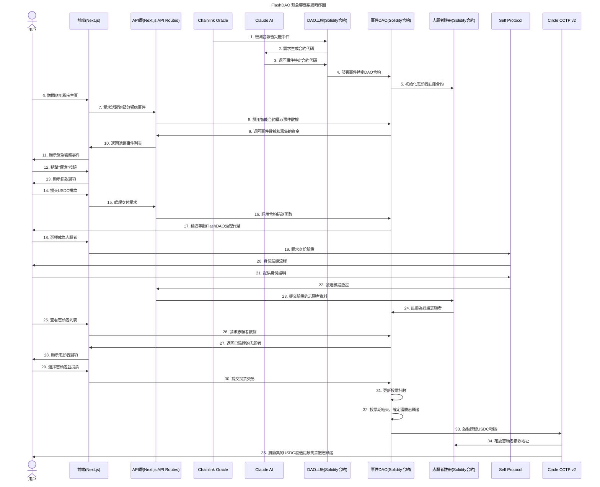

```mermaid
sequenceDiagram
    title FlashDAO 緊急響應系統時序圖
    
    actor User as 用戶
    participant FE as 前端(Next.js)
    participant API as API層(Next.js API Routes)
    participant Oracle as Chainlink Oracle
    participant Claude as Claude AI
    participant Factory as DAO工廠(Solidity合約)
    participant EventDAO as 事件DAO(Solidity合約)
    participant Registry as 志願者註冊(Solidity合約)
    participant Self as Self Protocol
    participant CCTP as Circle CCTP v2
    
    %% 災難事件檢測
    Oracle->>Factory: 1. 檢測並報告災難事件
    Factory->>Claude: 2. 請求生成合約代碼
    Claude->>Factory: 3. 返回事件特定合約代碼
    
    %% DAO 創建
    Factory->>EventDAO: 4. 部署事件特定DAO合約
    EventDAO->>Registry: 5. 初始化志願者註冊合約
    
    %% 用戶前端互動
    User->>FE: 6. 訪問應用程序主頁
    FE->>API: 7. 請求活躍的緊急響應事件
    API->>EventDAO: 8. 調用智能合約獲取事件數據
    EventDAO->>API: 9. 返回事件數據和籌集的資金
    API->>FE: 10. 返回活躍事件列表
    FE->>User: 11. 顯示緊急響應事件
    
    %% 捐款流程
    User->>FE: 12. 點擊"響應"按鈕
    FE->>User: 13. 顯示捐款選項
    User->>FE: 14. 提交USDC捐款
    FE->>API: 15. 處理支付請求
    API->>EventDAO: 16. 調用合約捐款函數
    EventDAO->>User: 17. 鑄造等額FlashDAO治理代幣
    
    %% 志願者註冊
    User->>FE: 18. 選擇成為志願者
    FE->>Self: 19. 請求身份驗證
    Self->>User: 20. 身份驗證流程
    User->>Self: 21. 提供身份證明
    Self->>API: 22. 發送驗證憑證
    API->>Registry: 23. 提交驗證的志願者資料
    Registry->>EventDAO: 24. 註冊為認證志願者
    
    %% 投票流程
    User->>FE: 25. 查看志願者列表
    FE->>EventDAO: 26. 請求志願者數據
    EventDAO->>FE: 27. 返回已驗證的志願者
    FE->>User: 28. 顯示志願者選項
    User->>FE: 29. 選擇志願者並投票
    FE->>EventDAO: 30. 提交投票交易
    EventDAO->>EventDAO: 31. 更新投票計數
    
    %% 資金分配
    EventDAO->>EventDAO: 32. 投票期結束，確定獲勝志願者
    EventDAO->>CCTP: 33. 啟動跨鏈USDC轉賬
    CCTP->>Registry: 34. 確認志願者接收地址
    CCTP->>User: 35. 將籌集的USDC發送給最高票數志願者
``` 